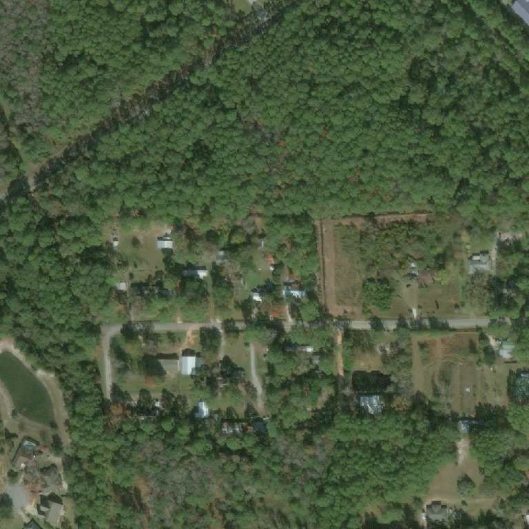

# Useful approaches, practices and tools used in solving greenfield computer vision problems

## The Challenge

- In the xView2 challenge, competitors are asked to identify damaged buildings in satellite imagery following a natural disaster.
- Two images: before and after.
- Find building footprints using the 'before' image.
- Classify each of those footprints into one of four damage categories based on the 'after' image.

| Before | After |
| --- | --- |
|   | |

| Description | Image |
| --- | --- |
|Before target||
|After target||
|Alignment||

## Why this problem?

- This problem is an analytical bottleneck in disaster response, and solving it has imminent real world benefits.
- It's feasible: there is sufficient high quality annotated data.
- It's really interesting from a technical perspective: at first glance it seems simple, but there are a lot of potentially valid approaches.
- It's very well supported and positioned to be implemented after the competition.

- Cf.: [Understanding Clouds from Satellite Images](https://www.kaggle.com/c/understanding_cloud_organization).
    - Poor annotator agreement.
    - Indirectly applicable.
    - Annotation requires lots of finicky manual processing.
    

## Technical challenges

- Before/after image. 
- Resolution: output is 1024x1024 (small batch sizes).
- Above + metric = stability issues.

## Possible approaches

- Example solution: semantic segmentation and patch-classification.
- This is in the spirit of 'R-CNN' e.g. regional cnn.

| Semantic | Instance |
| --- | --- |
|   | |

- Semantic segmentation: some tricks with upscaling and pooling across layers, but mostly pretty simple – encoder + decoder setup.
- Instance segmentation: this came out of object detection (bounding boxes), and is a little crazy. 1000s of overlapping potential bounding boxes are proposed by one RoI (region-of-interest) network, before each one is pooled into a fixed size representation and classified/adjusted. Lots of post-processing required to handle the overlapping boxes, and an absurd number of hyperparams. There are much nicer solutions (e.g. [Objects as points].)

## Proposed Architecture

- Semantic segmentation on 'before' image to define regions of interest.
- RoI-pooling + classification on 'after' images. 
- Why semantic segmentation on 'before' image? Much better recall: instance segmentation comes from the world of e.g. CoCo – where evaluation is measured by the number of 'good enough' masks. This task is evaluated on the pixel level.
    - In addition, we can – one of the issues with instance segmentation is going from mask -> individual instances. We're evaluated at pixel level so this isn't essential.
- Why RoI pooling/object detection approach on the second image? This corresponds with the way that the images are labeled e.g. each polygon is classified into one of several categories.
    - It also addresses the labeling drift – bounding boxes are much closer than the masks.
    - Alternative: segmentation. A little more finicky to set-up.
- Heavy data augmentation, half-precision training, Linknet segmentation with efficientnet backbone.

## Experimental Setups

- All experiments managed using [Wandb](https://app.wandb.ai/xvr-hlt/sky-eye-full?workspace=user-xvr-hlt).
    - Config management.
    - Models saved to cloud.
    - Experimental management.
    - Recreating runs.
    - Easy to setup.
- Try and move from big to little picture. E.g. architecture -> loss -> model, etc.
- Be aware of metric – f-score is sensitive to threshold and noise – loss is more stable, but less interpretable. 
- Find minimum experimental setup: e.g. performance @ [512x512](https://app.wandb.ai/xvr-hlt/sky-eye-full/runs/ulzmrrsr?workspace=user-xvr-hlt) resolution generalizes to [1024x1024](https://app.wandb.ai/xvr-hlt/sky-eye-full/runs/je2in7no?workspace=user-xvr-hlt) (and trains 4x faster).
- Notebook + lean codebase (frequently re-iterate).

## Selected experiments

- Building segmentation
    - [Semantic segmentation]() outperforms [instance segmentation](https://app.wandb.ai/xvr-hlt/sky-eye-full/runs/2a4h1a2q?workspace=user-xvr-hlt).
    - Segmentation architectures: [LinkNet](https://app.wandb.ai/xvr-hlt/sky-eye-full/runs/n1sjxbai/overview) and [UNet](https://app.wandb.ai/xvr-hlt/sky-eye-full/runs/rpu0bhol/overview) have better performance profiles vs. [FPN](https://app.wandb.ai/xvr-hlt/sky-eye-full/runs/hsogqx3z?workspace=user-xvr-hlt) and [PSPNet](https://app.wandb.ai/xvr-hlt/sky-eye-full/runs/9lvz3chz/system).
    - Pretraining: [static pretrained architecture](https://solaris.readthedocs.io/en/latest/pretrained_models.html) vs [hand-rolled](https://app.wandb.ai/xvr-hlt/sky-eye-full/runs/rpu0bhol/overview).
    - Train models separately or together? [Joint training/models](https://app.wandb.ai/xvr-hlt/sky-eye-full/runs/ch8ist1l?workspace=user-xvr-hlt) don't seem to outperform [individually trained](https://app.wandb.ai/xvr-hlt/sky-eye-full/runs/eaqy65bh?workspace=user-xvr-hlt) models.
    - Data augmentation: applying [25%](https://app.wandb.ai/xvr-hlt/sky-eye-full/runs/3ret9bp7?workspace=user-xvr-hlt), [50%](https://app.wandb.ai/xvr-hlt/sky-eye-full/runs/ulzmrrsr?workspace=user-xvr-hlt), [75%](https://app.wandb.ai/xvr-hlt/sky-eye-full/runs/3ret9bp7?workspace=user-xvr-hlt) of the time.
    - Different losses: [Focal](https://app.wandb.ai/xvr-hlt/sky-eye-full/runs/cbqlwfjy) vs. [Focal + IoU](https://app.wandb.ai/xvr-hlt/sky-eye-full/runs/cd6uodg5?workspace=user-xvr-hlt).
    - Half precision training using AMP in the default mode works best. See: [full precision](https://app.wandb.ai/xvr-hlt/sky-eye-full/runs/nf4axyr0?workspace=user-xvr-hlt) lower batch size, [half-precision (default)](https://app.wandb.ai/xvr-hlt/sky-eye-full/runs/i1op16sa?workspace=user-xvr-hlt) 82% mem@batch8, [half-precision (alternative)](https://app.wandb.ai/xvr-hlt/sky-eye-full/runs/ycet76vn?workspace=user-xvr-hlt) 86% mem@batch8, more variance.

## To do

- Much more possible work on the damage classification component.
- Deformable convolutions.
- [Class-context concatenation](https://github.com/PkuRainBow/OCNet.pytorch).
- Different batch norms – frozen BN, group BN.
- [Explicit edge categorisation](https://paperswithcode.com/paper/gated-scnn-gated-shape-cnns-for-semantic) in a separate CNN module.

## Useful tools
- [Wandb](http://wandb.com/).
- [Apex](https://github.com/NVIDIA/apex/tree/master/apex/amp) – half-precision/mixed-precision training from NVIDIA.
- [Segmentation Models Pytorch](https://github.com/qubvel/segmentation_models.pytorch): lightweight, nice API for segmentation.
- [Detectron2](https://github.com/facebookresearch/detectron2): heavy-weight, more deeply integrated, harder to use – far more features and state of the art models. Complexity partly required by much more complicated approach.

## Competition vs. production
- Prioritising single metric over maintainability, readability, performance, generalisability etc.
- Great for learning new skills.

## Conclusions
- Solving the right problem.
- In the right way.
- Lean experimental setup.
- Lightweight codebase – the right balance between saving time now or saving time later.
